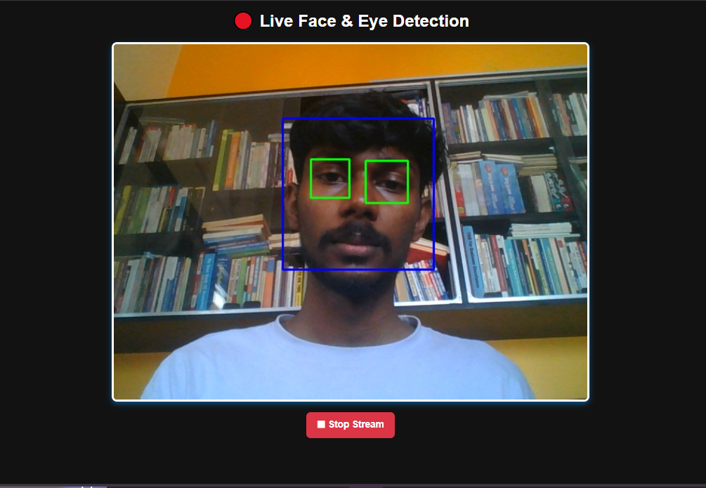

# 🔴 Real-Time Face & Eye Detection with Flask & OpenCV

This project is a **real-time face and eye detection web application** built using **Flask** and **OpenCV**. The system streams live video from the webcam and detects **faces and eyes** using Haar cascade classifiers.

## 📸 Demo
  

---

## 🚀 Features
✔️ **Real-Time Face & Eye Detection** using OpenCV  
✔️ **Live Video Streaming** via Flask  
✔️ **Haar Cascade Classifiers** for accurate detection  
✔️ **Responsive UI** with Bootstrap  
✔️ **Smooth Transitions & Animations** using JavaScript  

---

## 🛠️ Technologies Used
- **Python 3.x**
- **Flask**
- **OpenCV**
- **HTML5, CSS3, Bootstrap**
- **JavaScript (ES6)**
  
---

## 📂 Folder & File Descriptions

- **`static/`** → Contains CSS & JavaScript files for UI styling and interactions.  
- **`templates/`** → Contains the `index.html` file for rendering the web page.  
- **`Haarcascades/`** → Stores the pre-trained Haar cascade classifiers for face & eye detection.  
- **`app.py`** → The Flask application handling live video streaming & detection.  
- **`requirements.txt`** → Lists dependencies required for the project.  
- **`README.md`** → Documentation for setup, usage, and customization.  

---

## 🛠️ Setup & Installation  

### **🔹 Clone the Repository**  
```bash
git clone https://github.com/raahulramakrishnan09/Face-Eye-Detection-Flask.git
cd Face-Eye-Detection-Flask
```

### **🔹 Create & Activate a Virtual Environment**
```bash
# On Windows
python -m venv venv
venv\Scripts\activate

# On macOS / Linux
python3 -m venv venv
source venv/bin/activate
```
### **🔹 Install Dependencies**
```bash
pip install -r requirements.txt
```
### **🔹 Run the Flask Application**
```bash
python app.py
```
### **🔹 Open in Browser**

Go to **`http://127.0.0.1:5000/`** in your web browser.

---

## **📜 API Endpoints**
**`/`**	           →  Renders the homepage with the live stream

**`/video_feed`**	 →  Provides the real-time video feed for detection

---

## 📄 License
This project is open-source and available under the **`MIT License.**`
